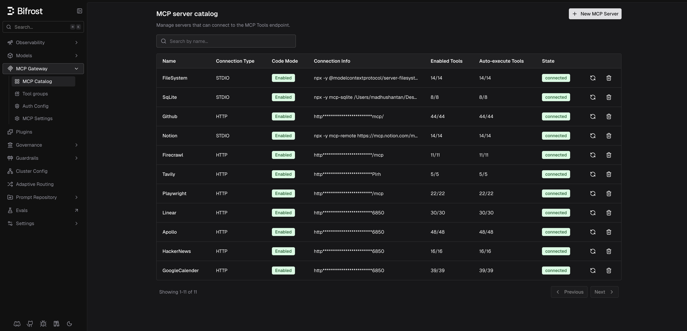

# MCP Code Mode Benchmark

Benchmarking suite for [Bifrost](https://github.com/maximhq/bifrost)'s MCP Code Mode feature. Measures token usage, latency, and pass rate using `claude-sonnet-4-6` as the primary model.

Three benchmark rounds:
- **Round 1**: 96 tools across 6 MCP servers, 64 queries
- **Round 2**: 251 tools across 11 MCP servers, 65 queries
- **Round 3**: 508 tools across 16 MCP servers, 65 queries

## What is Code Mode?

When you connect multiple MCP servers to an LLM, every request includes the full schema for every tool. With 100+ tools, this means tens of thousands of tokens are spent just describing tools — before the model even starts working.

[Code Mode](https://docs.getbifrost.ai/mcp/code-mode) solves this by replacing all raw tool definitions with 4 meta-tools:

| Meta-tool | Purpose |
|-----------|---------|
| `listToolFiles` | Discover available MCP servers and their tools |
| `readToolFile` | Load a tool's type definition on demand |
| `getToolDocs` | Get detailed documentation for a specific tool |
| `executeToolCode` | Run Python (Starlark) code that calls tools in a sandbox |

Instead of sending every tool schema on every request, the model discovers tools as needed and writes code to orchestrate them. Intermediate results stay in the sandbox instead of bouncing back through the model, reducing both token usage and latency.

### Binding Levels

- **Server-level**: One `.pyi` file per server. The model must guess which server has the tool it needs.
- **Tool-level**: One `.d.ts` file per tool. The model sees individual tool names in `listToolFiles` output, enabling better discovery.

## Summary

| Metric       | R1 OFF | R1 ON | R1 Change | R2 OFF | R2 ON | R2 Change | R3 OFF | R3 ON | R3 Change  |
| ------------ | ------ | ----- | --------- | ------ | ----- | --------- | ------ | ----- | ---------- |
| Servers/Tools| 6/96   | 6/96  |           | 11/251 | 11/251|           | 16/508 | 16/508|            |
| Queries      | 64     | 64    |           | 65     | 65    |           | 65     | 65    |            |
| Pass Rate    | 100%   | 100%  | —         | 98.5%  | 100%  | +1 query  | 100%   | 100%  | —          |
| Input Tokens | 19.9M  | 8.3M  | -58.2%    | 35.7M  | 5.5M  | -84.5%    | 75.1M  | 5.4M  | **-92.8%** |
| Total Tokens | 20.1M  | 8.5M  | -57.7%    | 35.8M  | 5.6M  | -84.3%    | 75.1M  | 5.5M  | **-92.7%** |
| Est. Cost    | $104   | $46   | -55.7%    | $180   | $30   | -83.4%    | $377   | $29   | **-92.2%** |
| Latency      | 85.8m  | 62.8m | -26.8%    | 37.6m  | 35.1m | -6.8%     | 43.8m  | 36.3m | -17.1%     |

> R1/R2/R3 = Round 1/2/3. OFF = Code Mode disabled. ON = Code Mode enabled (tool-level binding). Cost at Sonnet 4.6 pricing ($5/$25 per MTok).

Code Mode reduced input tokens by 58% at 96 tools, 85% at 251 tools, and 93% at 508 tools — hence cost savings of 56%, 83%, and 92% respectively, as Code Mode ON cost stays flat (~$29) regardless of how many tools are connected.

## Round 1 Results (96 tools, 6 servers)

Model: `anthropic/claude-sonnet-4-6` · Binding: tool-level · Queries: 64

| Metric | Code Mode OFF | Code Mode ON | Change |
|--------|--------------|-------------|--------|
| Pass Rate | 64/64 (100%) | 64/64 (100%) | — |
| Total Input Tokens | 19,867,724 | 8,306,687 | **-58.2%** |
| Total Output Tokens | 188,189 | 181,175 | -3.7% |
| Total Tokens | 20,055,913 | 8,487,862 | **-57.7%** |
| Total Latency | 85.8 min | 62.8 min | **-26.8%** |
| Est. Cost (Sonnet 4.6) | $104.04 | $46.06 | **-55.7%** |

Token reduction by query complexity (avg input tokens per query):

| Difficulty | OFF Avg | ON Avg | Reduction |
|-----------|---------|--------|-----------|
| Simple (20) | 122.5k | 26.5k | 78% |
| Medium (22) | 247.0k | 68.2k | 72% |
| Hard (14) | 628.4k | 381.6k | 39% |
| Edge (8) | 414.8k | 116.8k | 72% |

Full per-query breakdown in [`benchmark_report.md`](benchmark_report.md).

## Round 2 Results (251 tools, 11 servers)

Model: `anthropic/claude-sonnet-4-6` · Binding: tool-level · Queries: 65

### Code Mode OFF

| Metric | Value |
|--------|-------|
| Pass Rate | 64/65 (98.5%) |
| Total Input Tokens | 35,692,851 |
| Total Output Tokens | 64,090 |
| Total Tokens | 35,756,941 |
| Total Latency | 37.6 min |
| Avg Input Tokens / Query | ~549k |
| Est. Cost (Sonnet 4.6) | $180.07 |

| Difficulty | Pass | Avg Input Tokens | Avg Latency |
|-----------|------|-----------------|-------------|
| Simple (27) | 27/27 | 316.3k | 17.0s |
| Medium (38) | 37/38 | 714.5k | 47.3s |

With 251 tools, every API call sends ~135k tokens of tool schemas (vs ~39k with 96 tools in Round 1). Over a multi-turn agent loop, this compounds — a 4-turn query consumes ~540k input tokens. This is the scaling problem Code Mode addresses.

**Observations (Code Mode OFF):**

- **Tool parameter hallucination (R2M6)**: The model called `write_file` with only `{"path": "apollo_usage.txt"}`, omitting the required `content` parameter. It retried 60 times with identical broken arguments until timeout. The MCP server returned a validation error each time (`expected string on content path`), but the model never self-corrected. This was the only failed query.

- **Non-existent tool hallucination**: In 6 queries, the model called `LINEAR_GET_ALL_LINEAR_TEAMS` — a tool that doesn't exist. The actual tool `LINEAR_LIST_LINEAR_TEAMS` has a description that says _"Use LINEAR_GET_ALL_LINEAR_TEAMS instead when only identifiers are needed"_, referencing a non-existent tool. The model followed this bad recommendation. All 6 queries passed on re-run when the model picked the correct tool.

### Code Mode ON

| Metric | Value |
|--------|-------|
| Pass Rate | 65/65 (100%) |
| Total Input Tokens | 5,526,986 |
| Total Output Tokens | 86,710 |
| Total Tokens | 5,613,696 |
| Total Latency | 35.1 min |
| Avg Input Tokens / Query | ~85k |
| Est. Cost (Sonnet 4.6) | $29.80 |

| Difficulty | Pass | Avg Input Tokens | Avg Latency |
|-----------|------|-----------------|-------------|
| Simple (27) | 27/27 | 25.1k | 16.9s |
| Medium (38) | 38/38 | 127.6k | 43.4s |

### Round 2 Comparison

| Metric | Code Mode OFF | Code Mode ON | Change |
|--------|--------------|-------------|--------|
| Pass Rate | 64/65 (98.5%) | 65/65 (100%) | +1 query |
| Total Input Tokens | 35,692,851 | 5,526,986 | **-84.5%** |
| Total Output Tokens | 64,090 | 86,710 | +35.3% |
| Total Tokens | 35,756,941 | 5,613,696 | **-84.3%** |
| Total Latency | 37.6 min | 35.1 min | -6.8% |
| Est. Cost (Sonnet 4.6) | $180.07 | $29.80 | **-83.4%** |

**Observations (Code Mode ON):**

- **R2M6 now passes**: Code Mode ON correctly handled the `write_file` call via Starlark, including the `content` parameter that Code Mode OFF hallucinated away. 100% pass rate vs 98.5%.
- **Simple queries**: 92% input token reduction (316k → 25k avg). The 4 meta-tools replace ~135k tokens of tool schemas per turn.
- **Medium queries**: 82% input token reduction (714k → 128k avg). Savings compound over multi-turn agent loops.

## Round 3 Results (508 tools, 16 servers)

Model: `anthropic/claude-sonnet-4-6` · Queries: 65

### Code Mode OFF

| Metric | Value |
|--------|-------|
| Pass Rate | 65/65 (100%) |
| Total Input Tokens | 75,096,963 |
| Total Output Tokens | 52,286 |
| Total Tokens | 75,149,249 |
| Total Latency | 43.8 min |
| Avg Input Tokens / Query | ~1,155k |
| Est. Cost (Sonnet 4.6) | $376.79 |

| Difficulty | Pass | Avg Input Tokens | Avg Latency |
|-----------|------|-----------------|-------------|
| Simple (25) | 25/25 | 594.3k | 22.3s |
| Medium (40) | 40/40 | 1,506.0k | 51.7s |

With 508 tools, each API call sends ~275k tokens of tool schemas (vs ~135k at 251 tools, ~39k at 96 tools). A simple 2-turn query now consumes ~550k input tokens.

### Code Mode ON

| Metric | Value |
|--------|-------|
| Pass Rate | 65/65 (100%) |
| Total Input Tokens | 5,415,646 |
| Total Output Tokens | 90,037 |
| Total Tokens | 5,505,683 |
| Total Latency | 36.3 min |
| Avg Input Tokens / Query | ~83k |
| Est. Cost (Sonnet 4.6) | $29.33 |

| Difficulty | Pass | Avg Input Tokens | Avg Latency |
|-----------|------|-----------------|-------------|
| Simple (25) | 25/25 | 36.5k | 15.9s |
| Medium (40) | 40/40 | 114.8k | 44.5s |

### Round 3 Comparison

| Metric | Code Mode OFF | Code Mode ON | Change |
|--------|--------------|-------------|--------|
| Pass Rate | 65/65 (100%) | 65/65 (100%) | — |
| Total Input Tokens | 75,096,963 | 5,415,646 | **-92.8%** |
| Total Output Tokens | 52,286 | 90,037 | +72.2% |
| Total Tokens | 75,149,249 | 5,505,683 | **-92.7%** |
| Total Latency | 43.8 min | 36.3 min | -17.1% |
| Est. Cost (Sonnet 4.6) | $376.79 | $29.33 | **-92.2%** |

Token reduction scales with tool count: **58% at 96 tools → 84% at 251 tools → 93% at 508 tools**. Code Mode ON cost stays nearly flat (~$29) regardless of tool count, while Code Mode OFF cost grows linearly.

## Setup

### Prerequisites

- Python 3.10+
- [Bifrost](https://github.com/maximhq/bifrost) running locally (or remotely)
- MCP servers configured in Bifrost (see [MCP Servers](#mcp-servers))

### Install

```bash
pip install requests openai
```

### Configuration

All paths and URLs are configurable via environment variables:

| Variable | Default | Description |
|----------|---------|-------------|
| `BIFROST_BASE_URL` | `http://localhost:8080/openai` | Bifrost OpenAI-compatible endpoint |
| `BIFROST_API_KEY` | `dummy-key` | API key (or Bifrost virtual key) |
| `BENCH_WORKSPACE` | Script directory | Working directory for file operations |
| `BENCH_SQLITE_DB` | `../mcp-bifrost-sqlite/sqlite.db` | Path to SQLite database used by MCP |

Example:

```bash
export BIFROST_BASE_URL="http://localhost:8080/openai"
export BENCH_SQLITE_DB="/path/to/your/sqlite.db"
```

## MCP Servers

All MCP servers are registered in Bifrost's MCP server catalog with auto-execute enabled so the agent loop can run tool calls without manual approval.



### Round 1 (96 tools)

| Server | Tools | Connection | Setup |
|--------|-------|------------|-------|
| FileSystem | 14 | STDIO | `npx -y @modelcontextprotocol/server-filesystem <workspace_path>` |
| Firecrawl | 11 | HTTP | Self-hosted or cloud — get an API key from [firecrawl.dev](https://www.firecrawl.dev/), run the MCP server via `npx -y firecrawl-mcp` or connect to a hosted endpoint |
| GitHub | 44 | HTTP | Use the [GitHub MCP server](https://github.com/github/github-mcp-server) — requires a GitHub personal access token |
| Notion | 14 | STDIO | `npx -y mcp-remote https://mcp.notion.com/mcp` — requires a Notion integration token from [notion.so/my-integrations](https://www.notion.so/my-integrations) |
| SQLite | 8 | STDIO | `npx -y mcp-sqlite <path_to_db>` — provide the path to your SQLite database file |
| Tavily | 5 | HTTP | Get an API key from [tavily.com](https://tavily.com/), connect via their hosted MCP endpoint |

### Round 2 (251 tools)

All Round 1 servers plus:

| Server | Tools | Connection | Setup |
|--------|-------|------------|-------|
| Playwright | 22 | HTTP | Run via `npx @anthropic/mcp-playwright` or connect to a hosted endpoint — no API key needed |
| Linear | 30 | HTTP | Connected via [Composio](https://composio.dev/) — create a Composio account, connect your Linear workspace, and use the Composio MCP endpoint with your API key |
| Apollo | 48 | HTTP | Connected via [Composio](https://composio.dev/) — link your Apollo.io account through Composio and use the MCP endpoint |
| HackerNews | 16 | HTTP | Connected via [Composio](https://composio.dev/) — no auth needed, just enable the HackerNews app in Composio |
| Google Sheets | 39 | HTTP | Connected via [Composio](https://composio.dev/) — connect your Google account through Composio's OAuth flow |

### Round 3 (508 tools)

All Round 2 servers plus:

| Server | Tools | Connection | Setup |
|--------|-------|------------|-------|
| Google Calendar | 43 | HTTP | Connected via [Composio](https://composio.dev/) — connect your Google account through Composio's OAuth flow |
| Google Drive | 76 | HTTP | Connected via [Composio](https://composio.dev/) — connect your Google account through Composio's OAuth flow |
| Google Docs | 33 | HTTP | Connected via [Composio](https://composio.dev/) — connect your Google account through Composio's OAuth flow |
| Calendly | 51 | HTTP | Connected via [Composio](https://composio.dev/) — connect your Calendly account through Composio's OAuth flow |
| Figma | 52 | HTTP | Connected via [Composio](https://composio.dev/) — connect your Figma account through Composio's OAuth flow |

See [`mcp_tools/`](mcp_tools) for the per-round tool inventories.

## Running Benchmarks

### 1. Toggle Code Mode

In the Bifrost UI: MCP server catalog → click each server → toggle Code Mode ON or OFF → Save.

For binding level: when Code Mode is ON, select "Server-level" or "Tool-level" binding.

### 2. Clean workspace

```bash
# Round 1
python benchmark.py cleanup

# Round 2
python benchmark.py cleanup --eval-file eval_tasks/eval_tasks_r2.json

# Round 3
python benchmark.py cleanup --eval-file eval_tasks/eval_tasks_r3.json
```

This resets the workspace: deletes files/directories created by previous queries, drops all SQLite tables, and reminds you to clean up external resources (Notion pages, Google Sheets, Linear issues) manually.

### 3. Run benchmark

```bash
# Round 1 — Code Mode OFF
python benchmark.py run --name cm_off_sonnet4_6 --model anthropic/claude-sonnet-4-6

# Round 1 — Code Mode ON (toggle in Bifrost UI first)
python benchmark.py run --name cm_on_sonnet4_6 --model anthropic/claude-sonnet-4-6

# Round 2 — Code Mode OFF
python benchmark.py run --name r2_cm_off_sonnet4_6 --model anthropic/claude-sonnet-4-6 --eval-file eval_tasks/eval_tasks_r2.json

# Round 2 — Code Mode ON
python benchmark.py run --name r2_cm_on_sonnet4_6 --model anthropic/claude-sonnet-4-6 --eval-file eval_tasks/eval_tasks_r2.json

# Round 3 — Code Mode OFF
python benchmark.py run --name r3_cm_off_sonnet4_6 --model anthropic/claude-sonnet-4-6 --eval-file eval_tasks/eval_tasks_r3.json

# Round 3 — Code Mode ON
python benchmark.py run --name r3_cm_on_tool_sonnet4_6 --model anthropic/claude-sonnet-4-6 --eval-file eval_tasks/eval_tasks_r3.json

# Filter by difficulty
python benchmark.py run --name test_simple --model anthropic/claude-sonnet-4-6 --difficulty simple

# Resume from a specific query
python benchmark.py run --name r2_cm_off --model anthropic/claude-sonnet-4-6 --eval-file eval_tasks/eval_tasks_r2.json --start-from R2M10

# Re-run specific queries (replaces old results, keeps the rest)
python benchmark.py run --name r2_cm_off --model anthropic/claude-sonnet-4-6 --eval-file eval_tasks/eval_tasks_r2.json --queries R2S7 R2M3
```

### 4. View results

```bash
python benchmark.py summary --name r2_cm_off_sonnet4_6
```

### 5. Fetch detailed logs

```bash
python benchmark.py fetch-logs --name r2_cm_off_sonnet4_6
```

Fetches full agent loop conversation logs from Bifrost's API and saves per-query JSON files to `runs/<name>/logs/`.

## Supported Models

Any model routed through Bifrost. Primary benchmark model: `anthropic/claude-sonnet-4-6`.

Other tested models:

```
anthropic/claude-opus-4-6
openai/gpt-5.4
gemini/gemini-3.1-pro
```

## Eval Query Design

### Round 1 (`eval_tasks/eval_tasks.json`)

64 queries across 4 difficulty levels:

- **Simple (20)**: Single server, 1-2 tool calls. e.g., "List files in the current directory"
- **Medium (22)**: 2 servers, multi-step. e.g., "Search web for X, save results to file"
- **Hard (14)**: 3+ servers, chaining, data transformation. e.g., "Search GitHub repos, get READMEs, store in SQLite, generate report"
- **Edge (8)**: Error recovery, ambiguous queries, hallucination traps

### Round 2 (`eval_tasks/eval_tasks_r2.json`)

65 queries across 2 difficulty levels, focused on action-oriented tasks (not pure extraction):

- **Simple (27)**: Single server, 1-2 tool calls
- **Medium (38)**: 2-3 servers, multi-step workflows

Round 2 covers 11 servers: Apollo, FileSystem, Firecrawl, GitHub, Google Sheets, HackerNews, Linear, Notion, Playwright, SQLite, Tavily.

### Round 3 (`eval_tasks/eval_tasks_r3.json`)

65 queries across 2 difficulty levels, expanding coverage to 16 MCP servers:

- **Simple (25)**: Single server, 1-2 tool calls
- **Medium (40)**: 2-3 servers, multi-step workflows

Round 3 adds 5 new servers: Google Calendar, Google Drive, Google Docs, Calendly, Figma.

Each query specifies:

```json
{
  "id": "R2S1",
  "difficulty": "simple",
  "query": "Get the current Hacker News frontpage posts with at least 100 points.",
  "expected_servers": ["HackerNews"],
  "expected_tools": ["get_hacker_news_frontpage"],
  "success_criteria": "Returns HN post titles with point counts",
  "side_effects": {"files": [], "directories": [], "sqlite_tables": []}
}
```

## Project Structure

```
.
├── benchmark.py          # Benchmark runner (run, cleanup, summary, fetch-logs)
├── benchmark_report.md   # Full comparison results across all rounds
├── mcp_catalog.png       # Screenshot of Bifrost MCP server catalog
├── eval_tasks/           # Benchmark query sets by round
│   ├── eval_tasks.json   # Round 1: 64 eval query definitions (96 tools)
│   ├── eval_tasks_r2.json # Round 2: 65 eval queries (251 tools)
│   └── eval_tasks_r3.json # Round 3: 65 eval queries (508 tools)
├── mcp_tools/            # Tool inventories by round
│   ├── round1.json       # Round 1: 96 tools
│   ├── round2.json       # Round 2: 251 tools
│   └── round3.json       # Round 3: 508 tools
├── runs/                 # Benchmark results
│   ├── <run_name>/
│   │   ├── config.json   # Run metadata (model, timestamps)
│   │   ├── results.json  # Per-query results (tokens, latency, response)
│   │   └── logs/         # Full agent loop logs from Bifrost (gitignored)
└── README.md
```

